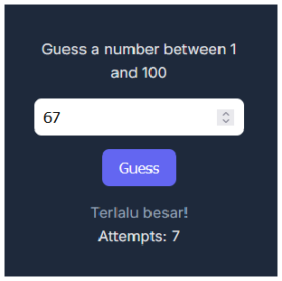
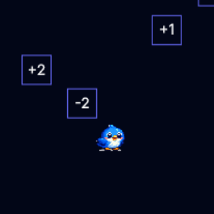

# Mini Games

"Web page to host some of lightweight games that can run on browser"

## Overview
People love playing easy to access games, this web page built so people can enjoy games anywhere anytime without the need to download and install.

## Featured Games
1. Tebak Angka
Guessing a random number between 1 - 100

<p align="center">
  
</p>

2. Math Dodge
Falling block and math combination

<p align="center">
  
</p>

## Project Structure
```
mini-games/
|-img/
   |image.jpg
   ...
   |image.jpg
|-matchdodge/
   |index.html
   |style.css
   |script.js
   |sprite.png   
|-tebakangka/
   |index.html
   |style.css
   |script.js
   |sprite.png 
|-index.html
|-main.js
|-main.css
|-README.md
```

## Tech Stack
- HTML + CSS + JS

## Closing
This page only purpose is to provide easy-to-access and lightweight games for people, and maybe provide place for people that want to create one

## Future Improvement
- More mini games
